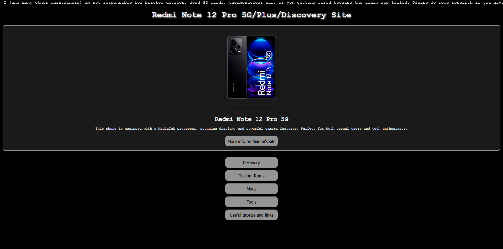

<h1 align="center">★ RUBY ESSENTIALS ★</h1>

  

RUBY ESSENTIALS is a comprehensive collection of resources and tools designed for users of the Redmi Note 12 Pro 5G/Plus/Discovery 5G. This project gathers everything you need to enhance your device's functionality, customize it, and troubleshoot effectively.

## Features

This repository includes:

- **Root Applications:**
  Explore a variety of apps that utilize root access to provide advanced features and customization.

- **Custom ROMs:**
  A curated list of custom ROMs for rubyx (RUBY/RUBYPLUS/RUBYPRO), along with installation instructions to give your device a new look and feel.

- **Recoveries:**
  Access recommended recoveries (e.g., TWRP, Lineage) tailored for rubyx (RUBY/RUBYPLUS/RUBYPRO), along with installation methods.

- **Mods:**
  Tweaks and modifications to optimize performance, improve battery life, and unlock additional features.

- **Tools:**
  Essential tools to assist with unlocking, flashing, and managing your device.

- **Useful Groups and Links:**
  Stay connected with helpful communities and access essential resources.

## Supported Devices

- **Redmi Note 12 Pro 5G** (Codename: RUBY)
- **Redmi Note 12 Pro+ 5G** (Codename: RUBYPLUS)
- **Redmi Note 12 Pro Discovery 5G** (Codename: RUBYPRO)

